## Table of Contents:

**1. Introduction**

**2. Data Overview**

**3. Data Preprocessing**

**4. Deep Learning Models**

**5. Results**

## Introduction

### Description
The directory contains data to train a model to predict the function of protein domains, based on the PFam dataset.

Domains are functional sub-parts of proteins; much like images in ImageNet are pre segmented to contain exactly one object class, this data is presegmented to contain exactly and only one domain.

The purpose of the dataset is to repose the PFam seed dataset as a multiclass classification machine learning task.

The task is: given the amino acid sequence of the protein domain, predict which class it belongs to. There are about 1 million training examples, and 18,000 output classes.

### Problem Statement:
Given the amino acid sequence of the protein domain, predict which class it belongs to.

Sources:
<br>
[pfam-seed-random-split](https://www.kaggle.com/googleai/pfam-seed-random-split)

### Data

### Data Overview
The approach used to partition the data into training/dev/testing folds is a random split.

Training data should be used to train your models.
<br>
Dev (development) data should be used in a close validation loop (maybe for hyperparameter tuning or model validation).
<br>
Test data should be reserved for much less frequent evaluations - this helps avoid overfitting on your test data, as it should only be used infrequently.

The training data looks like this

<p align="center">
  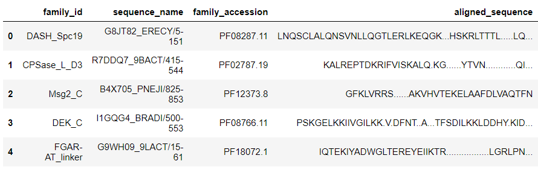
</p>


Each fold (train, dev, test) has a number of files in it. Each of those files contains csv on each line, which has the following fields:
- sequence: HWLQMRDSMNTYNNMVNRCFATCIRSFQEKKVNAEEMDCTKRCVTKFVGYSQRVALRFAE

- family_accession: PF02953.15

- sequence_name: C5K6N5_PERM5/28-87

- aligned_sequence: ....HWLQMRDSMNTYNNMVNRCFATCI...........RS.F....QEKKVNAEE.....MDCT....KRCVTKFVGYSQRVALRFAE

- family_id: zf-Tim10_DDP

Description of fields: -
- sequence: These are usually the input features to your model. Amino acid sequence for this domain. There are 20 very common amino acids (frequency > 1,000,000), and 4 amino acids that are quite uncommon: X, U, B, O, Z.

- family_accession: These are usually the labels for your model. Accession number in form PFxxxxx.y (Pfam), where xxxxx is the family accession, and y is the version number. Some values of y are greater than ten, and so 'y' has two digits.

- family_id: One word name for family
- sequence_name: Sequence name, in the form " 𝑢𝑛𝑖𝑝𝑟𝑜𝑡𝑎𝑐𝑐𝑒𝑠𝑠𝑖𝑜𝑛𝑖𝑑/ start_index-$end_index".
- aligned_sequence: Contains a single sequence from the multiple sequence alignment (with the rest of the members of the family in seed, with gaps retained.
- Generally, the family_accession field is the label, and the sequence (or aligned sequence) is the training feature.


### Performance Metric 

Metric(s):  Micro F1 score, Accuracy

source : [Mean F Score](https://www.kaggle.com/wiki/MeanFScore/history/120331)

F1-score is the harmonic mean of precision and recall.

## Exploratory Data Analysis

**1. Families with the most sequences**

<p align="center">
  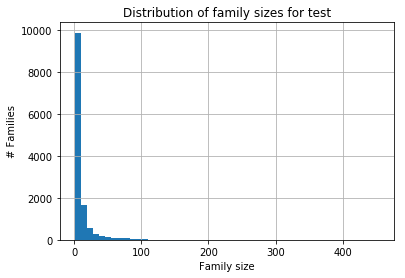
</p>

<p align="center">
  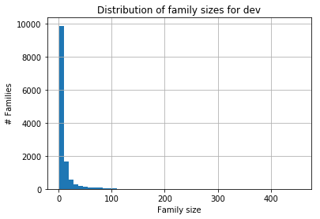
</p>

<p align="center">
  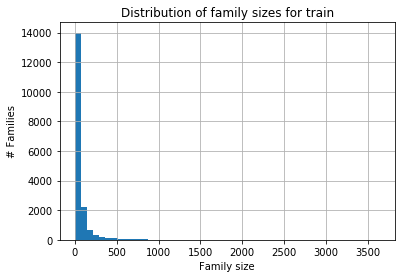
</p>

We can see that the train test and dev have same distribution.

**2. Families with the longest sequence length**

<p align="center">
  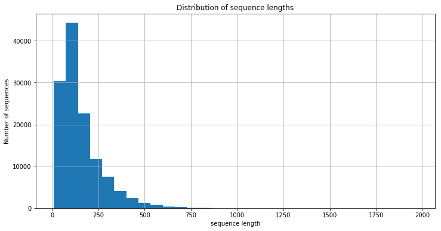
</p>

We can see that the average length of sequence is around 200

**3. CDF of family accessions**

<p align="center">
  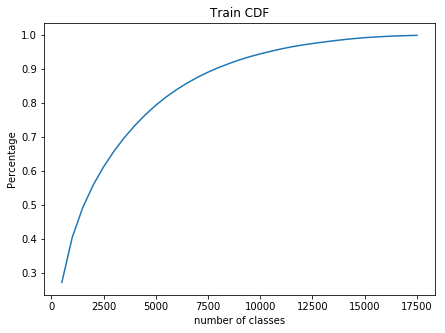
</p>

We consider only 1000 classes as it covers almost 40% of the data and also to reduce computation time
We can see that the average length of sequence is around 200


## Data Preprocessing

We First check for duplicate and null values and remove them from all train, test and dev dataset.
TO reduce the computation time, we consider only most common 1000 classes as it covers 40% of the total train dataset, for dev and test data 40% of the data is covered  by 800 classes. We use this data for processing.

We use the below function to get the reduced data
```
def get_allocate_value():
```

We label encode the output classes and then onehotencode the output.
```
def encode():
```


The sequence contains only first letter of amino acid.We convert it into 3 letter representation and seperate it with a space.
Below is the chart.

<p align="center">
  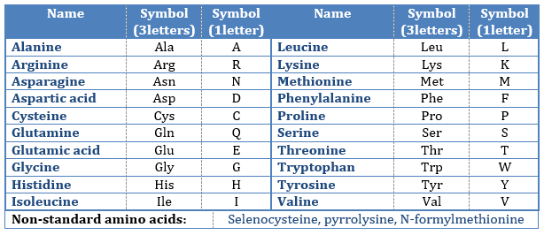
</p>

The below function does it.
```
def preprocess():
```
The input looks like this.
```
['Glu Glu Leu Met Asp Val Ser Thr Ala Val Asn Gly Ser Gly Pro Ala Phe Ala Phe Tyr Leu Ile Asp Ala Met Lys Glu Ala Gly Ile Asp Gly Gly Leu Asp Pro Glu Gln Ala Glu Thr Leu Ala Ala Gln Thr Phe Lys Gly Ala Ala Glu Thr Val Leu Arg Asp Asp Arg Ser Val Ser Glu Leu Ile Asp Ala Val Cys Ser Pro Asn Gly Thr Thr Ile Glu Gly Met Glu Val Leu Trp Asp Ser Asp Ala Asp Ala Ala Val Ile Glu Ala Val Glu Ala Ala Glu Gln Arg Ser Arg Glu Leu',
 'Met Ser Val Val Gly Ala Leu Arg Gly His Arg Lys Ala Ile Met Cys Leu Ala Val Ala Ser Asp Leu Val Leu Ser Gly Ser Ala Asp Lys Ser Leu Arg Val Trp Arg']
 ```

## Deep Learning Models

### ProtCNN 

We will one hot encode the input sequence into L* 20 array such that each column represents one hot encoding of each amino acid and padding with zeroes, where L is the maximum length of the sequence. To reduce the computation time we take 100 as the max length.
Now the input contains 439,493 lists with each list containing 100* 20 shaped list corresponding to output variable.

<p align="center">
  
</p>

We Implement the ProtCNN model given in the paper - [Using Deep Learning to Annotate the Protein Universe
(https://www.biorxiv.org/content/10.1101/626507v2.full)
The ProtCNN networks uses ResNets. ResNets have an advantage that even on increasing the layers we dont get negative outcome and have higher accuracy with increasing depth. Below Fig. depicts the ResNet architecture, which includes dilated convolutions.

<p align="center">
  
</p>

Below is the architecture graph:

<p align="center">
  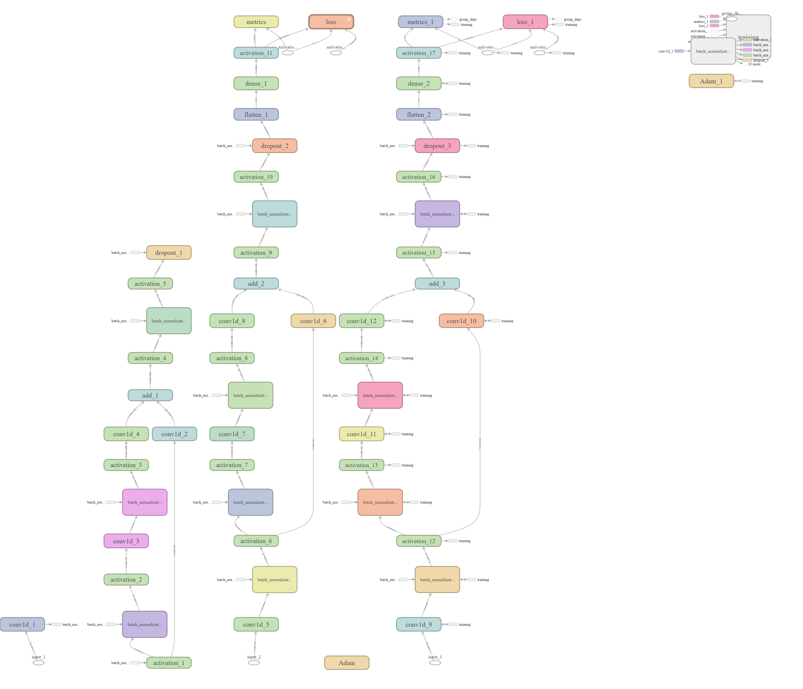
</p>

We have used a single ProtCNN model since it gave the best F1 score. We get an accuracy of 98. and f1 score of 0.987.

Plot of Training vs Validation Loss:
<p align="center">
  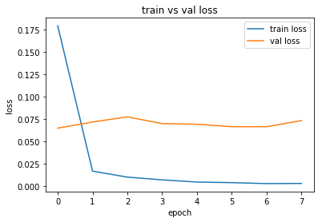
</p>

### MLP 

We use k-mer encoding which is same as BoW representation and we get both bi-gram and tri-gram representation of the sequence.
We use simple 2 Layered neural network with BatchNormalisation and a dropout of 0.2. We use ReLu as activation function. We used early stopping to reduce overfitting and save the model. We feed the bigram and trigram BoW input to the model and get best accuracy of 93.1% and f1 score of 0.93 on the test test using BoW Trigram. Below is the architecture used.

```
_________________________________________________________________
Layer (type)                 Output Shape              Param #   
=================================================================
dense_2 (Dense)              (None, 512)               251904    
_________________________________________________________________
dense_3 (Dense)              (None, 128)               65664     
_________________________________________________________________
batch_normalization_1 (Batch (None, 128)               512       
_________________________________________________________________
dropout_1 (Dropout)          (None, 128)               0         
_________________________________________________________________
dense_4 (Dense)              (None, 64)                8256      
_________________________________________________________________
dense_5 (Dense)              (None, 1000)              65000     
=================================================================
Total params: 391,336
Trainable params: 391,080
Non-trainable params: 256
_________________________________________________________________
```

Plot of Training vs Validation Loss:
<p align="center">
  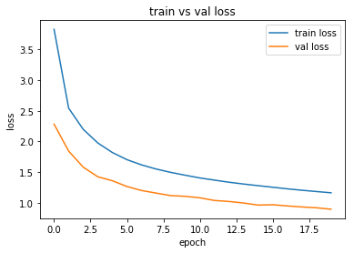
</p>

### LSTM

Recurrent neural networks, such as Long Short-Term Memory are specifically designed to support sequences of input data. and since we have a sequence input, we convert the input into indices and feed it to the model. We get an accuracy of 97.3 and f1 score of 0.973. Below is the architecture used.

```
_________________________________________________________________
Layer (type)                 Output Shape              Param #   
=================================================================
embedding_1 (Embedding)      (None, 100, 32)           160000    
_________________________________________________________________
lstm_1 (LSTM)                (None, 100)               53200     
_________________________________________________________________
dense_18 (Dense)             (None, 1000)              101000    
=================================================================
Total params: 314,200
Trainable params: 314,200
Non-trainable params: 0
_________________________________________________________________
```

Plot of Training vs Validation Loss:
<p align="center">
  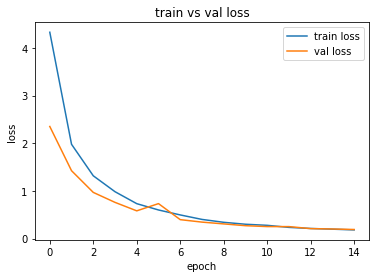
</p>

## Results

<p align="center">
  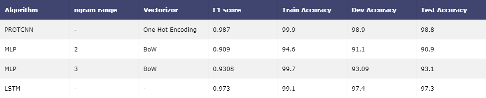
</p>

### Future Work

 1. We could use ProtENN model given in the paper which is an ensemble of ProtCNN models.
 2. We can use much larger dataset and all the classes.

### References

[Using Deep Learning to Annotate the Protein Universe](https://www.biorxiv.org/content/10.1101/626507v2.full)
<br>
[AppliedaiCourse](https://www.appliedaicourse.com/)
<br>
